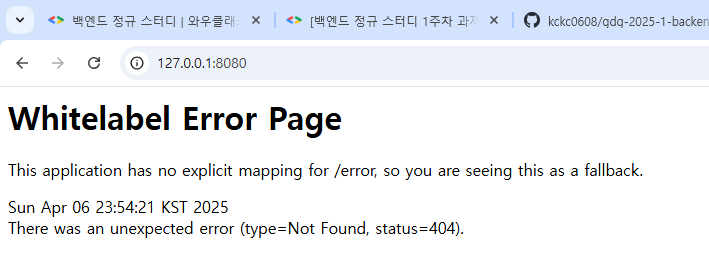

# WIL
## 웹
여러 컴퓨터가 서로 연결되어 정보를 공유하는 공간
## 클라이언트
연결된 컴퓨터 중에서, 요청을 보내는 쪽을 지칭하는 이름 
주로 서비스의 이용자가 클라이언트가 된다
## 서버
요청을 받아 그대로 처리하는 작업을 수행하는 컴퓨터 
주로 서비스 제공자가 서버가 된다.

## HTTP
트랜스포트 계층에서, 서버와 클라이언트가 통신하는 통신 규약

## 프론트엔드
웹서비스의 개발애서, 사용자 인터페이스를 개발하는 분야

## 백엔드
사용자가 볼 수 없는 DB나 서버를 개발하는 분야

## API
어플리케이션 사이에 상호작용할 인터페이스를 정의한 것

# 실행화면

# todomate API
## Method
### 회원관리
로그인 : POST /login  
로그아웃 : POST /logout 
회원가입 : POST /signup 
### 할 일 관리 
할일 조회 : POST  /todo/list 
할일 생성 : POST /todo 
할일 수정 : PATCH /todo/{todo_id} 
할일 삭제 : DELETE /todo/{todo_id} 
할일 체크 : POST /todo/{todo_id}/check 
할일 체크해제 : POST /todo/{todo_id}/uncheck 
할일 복제 : PATCH /todo/{todo_id} 
### 할일공유
친구조회 : POST  /freind 
친구추가 : POST  /freind/{friend_id} 
친구삭제 : DELETE  /freind/{friend_id} 
즐겨찾기 : POST /todo/{todo_id}/bookmark 
즐찾해제 : POST /todo/{todo_id}/del_bookmark 